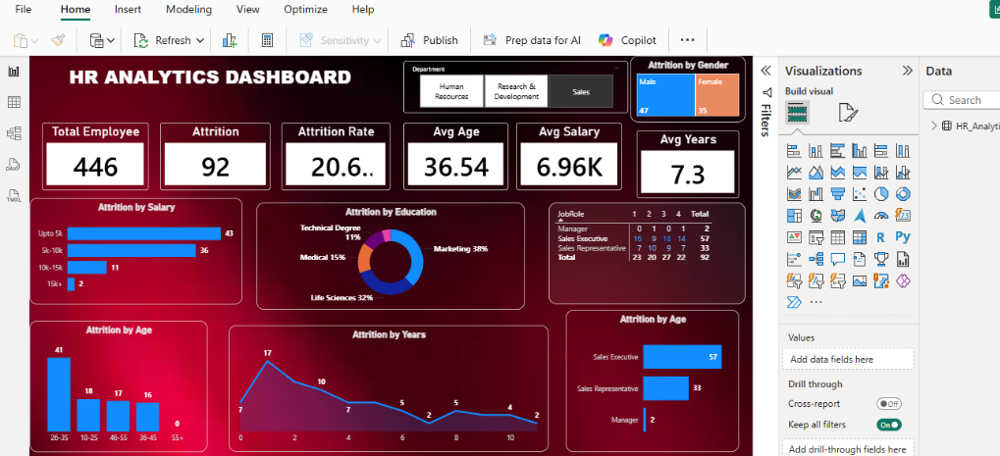

HR Analytics Dashboard

Dashboard Preview

Project Overview
This project is an HR Analytics Dashboard created using Power BI.  
It analyzes employee data to understand attrition trends and workforce insights.

Key Metrics
- Total Employees: 446
- Attrition Count: 92
- Attrition Rate: 20.6%
- Average Age: 36.54
- Average Salary: 6.96K
- Average Years at Company: 7.3

Dashboard Insights
The dashboard provides insights into:
- Attrition by Salary
- Attrition by Education
- Attrition by Age Group
- Attrition by Job Role
- Attrition by Years at Company
- Attrition by Gender

Tools Used
- Power BI
- Data Analysis
- Data Visualization
